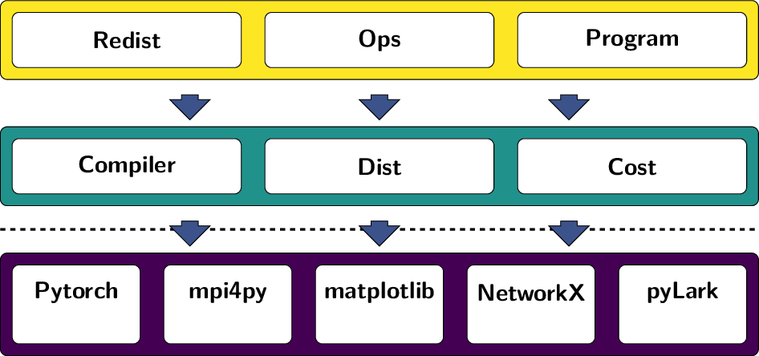

# tensorcraft

Collection of tools for working with and visualizing distributed tensors.

## Installation

Only source code installation for now:

```console
pip install -e .[dev,notebook]
```

## Dependencies

### Mandatory
- python >= 3.12
- torch >= 2.0.0
- lark
- matplotlib
- networkx
- drawsvg
- mpi4py

### Optional
- **Notebooks**
    - ipython
    - ipympl
    - ipyparallel
- **dev**
    - pytest
    - coverage
    - hypothesis[numpy] < 6.100
    - nbmake
    - pre-commit
    - python-semenatic-release>=9.0.0


## Stack



### Low

#### Compiler

#### Dist

#### Cost

### High (Optim)

#### Redist
#### Expression
#### Programm
